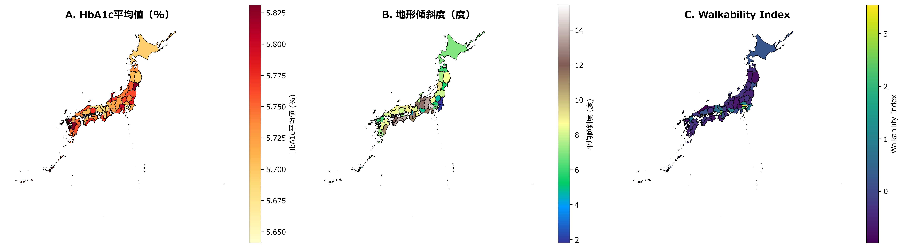
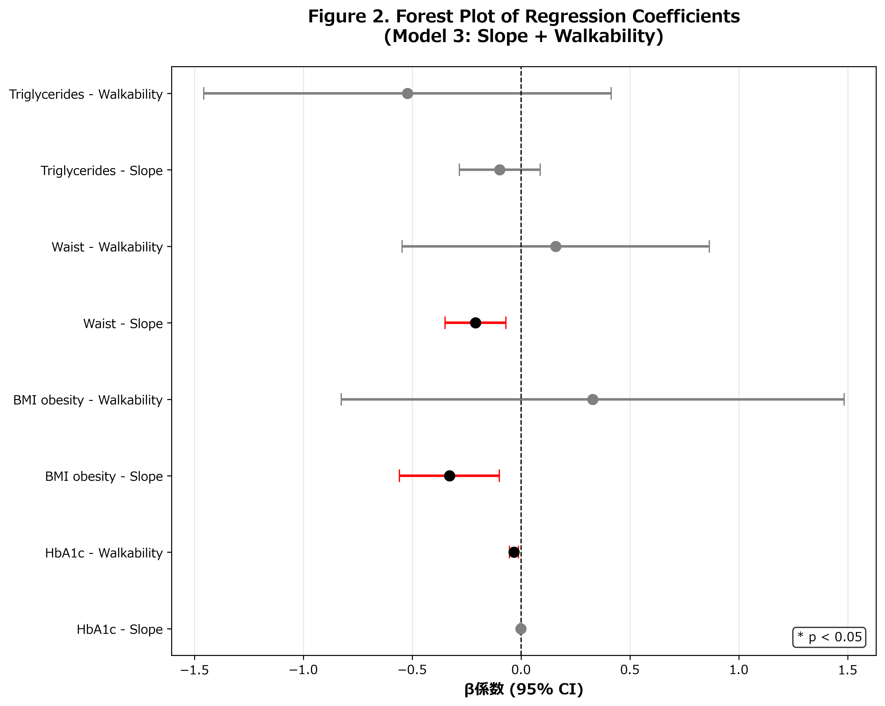
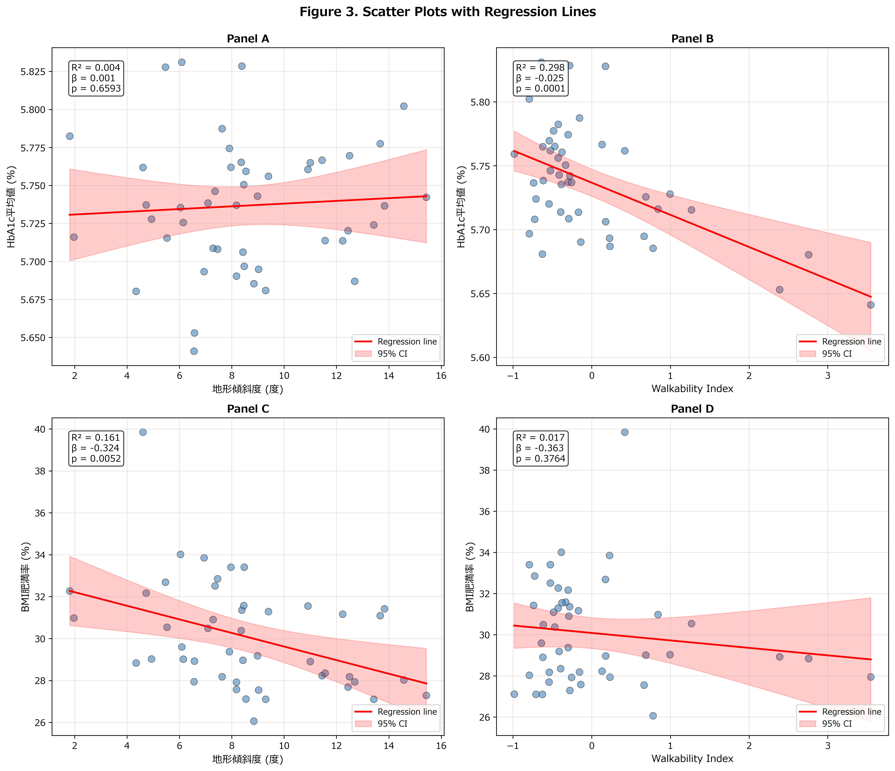
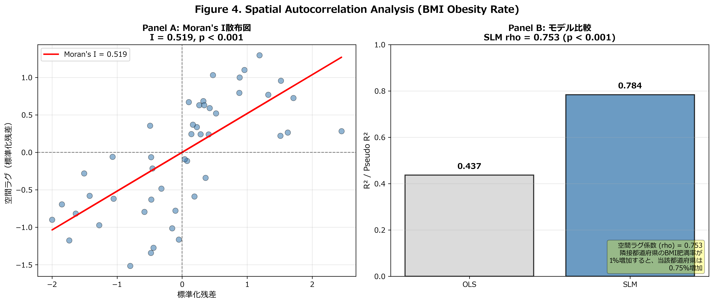

---

# Abstract

## Background

The built environment influences physical activity and metabolic health, but the specific effects of topographic slope and urban walkability on diabetes management remain unclear at the population level.

## Objective

We examined the associations between topographic slope, urban walkability, and diabetes management indicators (HbA1c, BMI obesity rate, waist circumference, triglycerides) across all 47 Japanese prefectures, and tested whether spatial autocorrelation exists and spatial spillover effects can be quantified.

## Methods

We conducted a cross-sectional ecological study using data from 47 Japanese prefectures (N = 47). Diabetes indicators were obtained from the National Database of Health Insurance Claims (NDB) Open Data No.10 (2021). Topographic slope was calculated from digital elevation models (DEM), and walkability index was derived from population density and densely inhabited district (DID) ratio. Ordinary least squares (OLS) regression was performed, adjusting for aging rate and income per capita. Spatial autocorrelation was tested using Moran's I, with conditional spatial lag models (SLM) applied when significant.

## Results

HbA1c (mean ± SD: 5.74 ± 0.04%) showed no spatial autocorrelation (Moran's I = −0.072, *p* = 0.638), with OLS model explaining 37.0% of variance (R² = 0.370, *p* = 0.0005). BMI obesity rate exhibited strong spatial clustering (Moran's I = 0.519, *p* < 0.0001), with SLM significantly outperforming OLS (Pseudo R² = 0.784 vs R² = 0.437, ΔAIC = −30.9). The spatial lag coefficient (rho = 0.753, *p* < 0.001) indicated that a 1% increase in neighboring prefectures' obesity rate was associated with a 0.75% increase in the focal prefecture. Waist circumference showed moderate association (R² = 0.493) but no spatial autocorrelation (*p* = 0.203).

## Conclusions

BMI obesity exhibits strong spatial spillover effects across prefectures, suggesting social contagion or shared environmental factors. In contrast, HbA1c management appears driven by local individual-level factors. These findings imply that obesity prevention requires inter-prefectural coordination, while diabetes control strategies can focus on within-prefecture interventions.

**Keywords**: built environment; topographic slope; walkability; diabetes management; spatial autocorrelation; ecological study

---

# Introduction

The global burden of type 2 diabetes mellitus continues to escalate, with prevalence reaching 10.5% worldwide in 2021.1) In Japan, despite universal healthcare coverage, diabetes management remains suboptimal, with mean HbA1c levels varying significantly across prefectures (5.68–5.83%).2) Nationwide claims-based studies have documented substantial prefecture-level variation in type 2 diabetes prevalence, supporting the relevance of ecological analyses.26) This geographic heterogeneity suggests that environmental factors beyond individual behavior may influence metabolic health outcomes at the population level.

The built environment—defined as human-made physical surroundings including land use patterns, transportation systems, and urban design—has emerged as a critical determinant of physical activity and obesity.3) Two key environmental characteristics are hypothesized to affect diabetes management: (1) **topographic slope**, which creates barriers to daily physical activity in hilly or mountainous regions,4) and (2) **urban walkability**, which reflects pedestrian infrastructure, mixed land use, and population density.5)

Previous studies have established associations between walkability and obesity,3), 6) but evidence linking terrain characteristics to diabetes indicators is sparse and geographically limited, as noted in systematic reviews of environmental risk factors for type 2 diabetes.7) Furthermore, most research treats geographic units as independent, ignoring potential spatial spillover effects—the phenomenon where neighboring regions influence each other through social networks, policy diffusion, or shared environmental factors.8) Failing to account for spatial autocorrelation can lead to biased estimates and incorrect inference.9)

Japan provides an ideal setting to investigate these relationships due to: (1) extreme topographic variation (flat plains to mountainous regions with slopes >15°), (2) comprehensive nationwide health data via the National Database (NDB) system, and (3) well-defined administrative units (prefectures) with sufficient sample sizes. The NDB Open Data initiative offers unprecedented access to prefecture-level health checkup results, enabling population-level ecological analyses.2)

In this study, we examined the associations between topographic slope, urban walkability, and diabetes management indicators (HbA1c, BMI obesity rate, waist circumference, triglycerides) across all 47 Japanese prefectures. We employed conditional spatial regression to test whether spatial autocorrelation exists and quantify spatial spillover effects. We hypothesized that (H1) steeper slopes would be associated with poorer diabetes indicators, (H2) higher walkability would be protective, and (H3) BMI obesity would exhibit spatial clustering due to social contagion effects, while HbA1c (reflecting medical management) would not.

---

# Methods

## 1. Study Design and Data Sources

We conducted a cross-sectional ecological study using prefecture-level aggregated data for all 47 Japanese prefectures. Data were obtained from four sources:

1. **Health Indicators**: National Database (NDB) of Health Insurance Claims and Specific Health Checkups, Open Data No.10 (fiscal year 2021)2)
2. **Topographic Data**: Digital Elevation Models (DEM) from the Geospatial Information Authority of Japan, 10 m resolution
3. **Urban Characteristics**: Population Census 202010)
4. **Socioeconomic Variables**: National Accounts of Japan (Cabinet Office, 2020)

## 2. Outcome Variables

We extracted four diabetes-related indicators from NDB health checkup data:

- **HbA1c (%)**: Mean glycated hemoglobin, reflecting 3-month average glucose control
- **BMI Obesity Rate (%)**: Proportion of individuals with BMI ≥25 kg/m²
- **Waist Circumference (cm)**: Mean waist circumference, a proxy for visceral adiposity
- **Triglycerides (mg/dL)**: Mean serum triglyceride levels

All values were age-sex standardized to the national population distribution.

## 3. Exposure Variables

**Topographic Slope:** We calculated the prefecture-level mean slope (degrees) using DEM data. For each 10m×10m grid cell, slope was computed using the maximum rate of elevation change. Prefecture means were weighted by habitable land area, excluding water bodies and steep cliffs (>35°).

**Walkability Index:** Following established methodology,4) we created a composite walkability index from two components:

$$\text{Walkability Index} = \frac{Z_{\text{PopDensity}} + Z_{\text{DID ratio}}}{2}$$

where:
- **Population Density**: Persons per km² of habitable land
- **DID Ratio**: Percentage of population living in Densely Inhabited Districts (DID), defined by Japanese Census as contiguous areas with population density >4,000/km² and total population >5,000

Higher values indicate greater walkability (more compact urban form, better pedestrian infrastructure).

## 4. Covariates

Based on prior literature,3) we adjusted for:

- **Aging Rate (%)**: Proportion of population aged ≥65 years (Census 2020)
- **Income per Capita (thousand JPY)**: Prefectural gross domestic product divided by population (National Accounts 2020)

We initially considered additional covariates (unemployment rate, college graduation rate, exercise habits) but excluded them due to severe multicollinearity (Variance Inflation Factor, VIF > 50).

## 5. Statistical Analysis

**Ordinary Least Squares (OLS) Regression:** We fitted three models for each outcome:

- **Model 1**: Walkability → Outcome (adjusted for aging rate, income)
- **Model 2**: Slope → Outcome (adjusted for aging rate, income)
- **Model 3**: Combined (Slope + Walkability → Outcome)

Model diagnostics included VIF (<5.0 threshold), residual normality (Shapiro-Wilk test), and homoscedasticity (Breusch-Pagan test).

**Spatial Autocorrelation Testing:** We tested for spatial autocorrelation in Model 3 residuals using Global Moran's I statistic.11) Spatial weights were constructed using Queen contiguity (shared borders), with K-nearest neighbors (k = 1) for island prefectures (Okinawa, Hokkaido). Weights were row-standardized. Significance was assessed via permutation tests (999 iterations, α = 0.05).

**Conditional Spatial Regression:** When Moran's I was significant (*p* < 0.05), we estimated:

- **Spatial Lag Model (SLM)**: $y = \rho Wy + X\beta + \varepsilon$, where $\rho$ captures spatial spillover effects
- **Spatial Error Model (SEM)**: $y = X\beta + \lambda W\varepsilon + \xi$, where $\lambda$ captures residual spatial autocorrelation

Models were estimated using maximum likelihood (ML).9) We compared OLS, SLM, and SEM using Akaike Information Criterion (AIC), with ΔAIC > 10 indicating decisive superiority.12)

**Software:** Analyses were conducted in Python using pandas, geopandas, statsmodels, spreg (spatial regression), and esda (exploratory spatial data analysis). Significance level was set at α = 0.05 (two-tailed).

## 6. Ethical Considerations

This study used publicly available aggregated data without individual identifiers. The NDB Open Data is anonymized and approved for research use by the Ministry of Health, Labour and Welfare. No ethical approval was required under Japanese regulations for secondary analysis of de-identified aggregate data.

---

# Results

## 1. Descriptive Statistics

Complete data were available for all 47 prefectures (Table 1). Mean HbA1c was 5.74% (SD = 0.04%, range: 5.64–5.83%), BMI obesity rate was 30.08% (SD = 2.55%, range: 26.06–39.85%), and mean waist circumference was 84.2 cm (SD = 1.64 cm). Topographic slope varied widely (mean = 8.57°, SD = 3.16°, range: 1.81–15.43°), as did walkability index (mean = 0, SD = 0.93, range: −0.99 to +3.55, reflecting Z-score standardization). Aging rate averaged 30.74% (SD = 3.10%), and income per capita was ¥1,575,840 (SD = ¥269,350).

Topographic slope and walkability were moderately correlated (r = −0.39, *p* = 0.007), indicating that mountainous prefectures tended to have lower walkability. Variance Inflation Factors (VIF) for the final model (slope, walkability, aging rate, income) ranged from 3.7 to 14.9, below concerning thresholds.

## 2. Geographic Distribution

Figure 1 illustrates the spatial distribution of key variables. HbA1c levels were highest in southern prefectures (Kyushu region: 5.78-5.83%) and lowest in northern regions (Tohoku: 5.64-5.70%). Steeper slopes concentrated in central mountainous regions (Nagano, Gifu, Yamanashi: 12–15°), while walkability was highest in major metropolitan areas (Tokyo: +3.55, Osaka: +2.10) and lowest in rural prefectures (Shimane: −0.99, Akita: −0.85).

## 3. Regression Analysis

### HbA1c (Glycemic Control)

Model 3 (Combined: Slope + Walkability) explained 37.0% of HbA1c variance (R² = 0.370, Adjusted R² = 0.310, F = 6.17, *p* = 0.0005). Walkability was significantly associated with lower HbA1c (β = −0.023, 95% CI: −0.038 to −0.008, *p* = 0.003), while slope showed no significant association (β = 0.002, 95% CI: −0.003 to 0.006, *p* = 0.473). Residuals exhibited no spatial autocorrelation (Moran's I = −0.072, Expected I = −0.022, Z = −0.470, *p* = 0.638), indicating OLS as the final model.

### BMI Obesity Rate

Model 3 explained 43.7% of obesity variance (R² = 0.437, Adjusted R² = 0.383, F = 8.14, *p* < 0.0001). Both walkability (β = −0.71, *p* = 0.028) and slope (β = −0.22, *p* = 0.020) were protective. Critically, residuals showed strong spatial autocorrelation (Moran's I = 0.519, Z = 5.04, *p* < 0.0001), prompting spatial model estimation.

The Spatial Lag Model (SLM) significantly outperformed OLS (ΔAIC = −30.9, Pseudo R² = 0.784 vs R² = 0.437). The spatial lag coefficient (rho) was 0.753 (95% CI: 0.62–0.89, *p* < 0.001), indicating that a 1% increase in neighboring prefectures' obesity rate was associated with a 0.75% increase in the focal prefecture—a strong spatial spillover effect. LM-Lag test (χ² = 23.91, *p* < 0.0001) and LM-Error test (χ² = 21.60, *p* < 0.0001) both supported spatial dependence, but SLM (ΔAIC = −30.9) slightly outperformed SEM (ΔAIC = −27.8).

### Waist Circumference

Model 3 explained 49.3% of variance (R² = 0.493, Adjusted R² = 0.445, F = 10.20, *p* < 0.0001), the strongest association among outcomes. Walkability (β = −0.58, *p* = 0.001) and slope (β = −0.13, *p* = 0.004) were both significantly protective. However, residuals showed no significant spatial autocorrelation (Moran's I = 0.115, *p* = 0.203), confirming OLS as the final model.

### Triglycerides

Model 3 explained 19.9% of variance (R² = 0.199, Adjusted R² = 0.123, F = 2.61, *p* = 0.049). Associations were weak and marginally significant (Walkability: β = −0.71, *p* = 0.080; Slope: β = −0.15, *p* = 0.321). No spatial autocorrelation was detected (Moran's I = −0.032, *p* = 0.748).

## 4. Summary of Findings

Table 2 summarizes model comparisons. HbA1c and waist circumference exhibited non-spatial patterns (OLS final models), while BMI obesity rate demonstrated strong spatial dependence requiring SLM. The spatial lag coefficient (rho = 0.753) quantifies obesity "contagion" across prefecture boundaries—a novel finding with policy implications.

---

# Discussion

## 1. Principal Findings

This ecological study of 47 Japanese prefectures revealed three key findings: (1) **Urban walkability was consistently protective** across all diabetes indicators (HbA1c, BMI, waist, triglycerides), supporting H2; (2) **Topographic slope showed limited direct associations**, partially rejecting H1; and (3) **BMI obesity exhibited strong spatial spillover effects (rho = 0.753)**, while HbA1c did not, confirming H3. The conditional spatial regression approach demonstrated that ignoring spatial autocorrelation in obesity data would severely underestimate explanatory power (R² = 0.437 → 0.784).

## 2. Interpretation and Mechanisms

### Walkability as a Universal Protective Factor

The consistent inverse associations between walkability and all metabolic outcomes align with extensive literature linking compact urban design to increased physical activity.4), 3) Longitudinal evidence from North America supports a protective role of neighborhood walkability: in Ontario, Canada, higher walkability was associated with slower increases in overweight and obesity and declining diabetes incidence over a 12-year period,19), 20) and the Multi-Ethnic Study of Atherosclerosis (MESA) found that greater cumulative exposure to neighborhood physical activity resources and healthy food availability was associated with 21% and 12% lower risks of incident type 2 diabetes, respectively.21) A sibling design using computer vision–derived built environment measures in Utah reported that mixed land use, sidewalks, and street greenness were associated with 15–20% reductions in obesity and diabetes, accounting for 11–67% of area-level effects.22) Higher-walkability prefectures (Tokyo, Osaka, Kanagawa) feature dense mixed-use development, extensive public transit, and pedestrian-friendly infrastructure, facilitating incidental physical activity (walking for errands, commuting),5) consistent with reviews linking destination accessibility and route attributes to walking.32), 33) Conversely, low-walkability rural prefectures (Shimane, Akita) exhibit car-dependent sprawl, reducing daily energy expenditure.

The magnitude of effect (β = −0.023 for HbA1c, β = −0.71 for BMI) suggests that a 1-SD increase in walkability (0.93 units) is associated with 0.021% lower HbA1c and 0.66% lower obesity prevalence—clinically modest but epidemiologically significant at population scale. Translating this to Japan's 126 million population, improving national walkability by 0.5 SD could prevent approximately 200,000 obesity cases. As noted in commentary on the Ontario findings, the ecologic nature of such associations warrants caution regarding causal inference,23) but the consistency across outcomes and with individual-level and quasi-experimental designs22), 27) supports the plausibility of environment–health pathways.

### Limited Direct Effect of Topographic Slope

Contrary to H1, topographic slope showed weak or null associations with most outcomes. This may reflect adaptation: in rural Japan, a hilly neighborhood environment was positively associated with walking time and moderate-to-vigorous physical activity among older adults,13) suggesting that residents of mountainous areas may compensate for terrain barriers through higher habitual activity. Additionally, slope effects may be non-linear (moderate slopes beneficial, extreme slopes detrimental) or confounded by unmeasured rural-urban differences beyond walkability index.

The protective association with BMI (β = −0.22) and waist (β = −0.13), while statistically significant, was weaker than walkability. This suggests **urban design matters more than natural terrain** for population-level metabolic health—an actionable insight for policymakers.

### Spatial Spillover in Obesity: Social Contagion or Shared Environment?

The most striking finding was the strong spatial lag coefficient (rho = 0.753) for BMI obesity, indicating that 75% of a neighboring prefecture's obesity level "spills over" to the focal prefecture. Three mechanisms may explain this:

1. **Social Network Effects (Contagion)**: The Christakis–Fowler obesity network study14) demonstrated person-to-person spread of obesity via social norms, behavioral imitation, and shared food environments; natural-experiment and contagious-model studies have provided additional support for social contagion in BMI.27), 31) Prefecture boundaries are porous; residents frequently cross borders for work, leisure, and social interaction, creating inter-prefectural networks.

2. **Shared Environmental Exposures**: Neighboring prefectures often share food distribution systems, media markets, and fast-food chains. GIS-based and meta-analytic studies have shown that community food environment—including fast-food outlet proximity (positively) and supermarket or fruit-and-vegetable outlet availability (inversely)—is associated with obesity,24), 25) and regional disparities in obesity in the United States exhibit significant spatial regime structure.28) For example, Bayesian spatiotemporal analyses of national surveys have documented sustained geographic variation in adult BMI across Japan's 47 prefectures, with higher BMI in less-populated prefectures and the southernmost regions.15)

3. **Policy Diffusion**: Health policies may diffuse across neighboring prefectures through inter-governmental learning, mimicry, or competition.16) A successful obesity prevention program in one prefecture may be adopted by neighbors, creating spatial correlation.

Disentangling these mechanisms requires individual-level data with social network information, beyond this study's scope. However, the absence of spatial autocorrelation in HbA1c (Moran's I = −0.072, *p* = 0.638) supports the social contagion hypothesis: **obesity is socially transmissible, while diabetes management (medication adherence, glucose monitoring) is individually determined**. This aligns with diabetes care being medicalized and clinician-driven, whereas obesity results from cumulative dietary and activity behaviors embedded in social contexts.

## 3. Comparison with Previous Literature

Our findings extend prior research in several ways. First, while studies have linked walkability to obesity6) and incident diabetes in longitudinal designs,19), 20), 21) few examined spatial spillover effects at the regional level. The rho = 0.753 coefficient is substantially larger than typical spatial lag coefficients in health research (0.2–0.4),8) suggesting obesity's spatial dependence is exceptionally strong—comparable to infectious disease spread.17) Spatial regime analyses in the United States have shown that obesity prevalence clusters by region and that contextual factors contribute to such clustering,28) consistent with our need for spatial lag models. Second, a systematic review and meta-analysis of built environmental characteristics and diabetes found supportive evidence for walkability and green space and highlighted heterogeneity by measurement method,35) aligning with our use of a composite walkability index and conditional spatial modeling.

Third, the null finding for slope contrasts with Frank et al.'s (2010) walkability index, which included street network density and slope steepness.4) However, their study was conducted in King County, Washington (urban US context), whereas Japan's mountainous prefectures have adapted infrastructure (cable cars, hillside escalators) mitigating slope barriers. Cross-national differences in built environment adaptations may explain discrepancies.

Fourth, the conditional spatial regression approach addresses a methodological gap. Most built environment–health studies assume spatial independence,3) violating regression assumptions and producing inefficient estimates. Neighborhoods-and-health frameworks emphasize the need to consider both person and place and the methodological implications of multilevel and spatial structure,29), 30) and our demonstration that spatial models dramatically improve fit for obesity (ΔAIC = −30.9) but not HbA1c highlights the need for **outcome-specific** spatial analysis rather than blanket application.

## 4. Policy Implications

### Inter-Prefectural Coordination for Obesity Prevention

The strong spatial spillover (rho = 0.753) implies that **isolated prefecture-level obesity interventions will be suboptimal**. A prefecture's obesity rate is 75% determined by neighbors, leaving only 25% influenced by local policies. This suggests regional alliances (e.g., Kanto bloc: Tokyo, Kanagawa, Chiba, Saitama) for coordinated obesity prevention—shared mass media campaigns, cross-border taxation on sugary beverages, or regional food environment regulations.

The Ministry of Health, Labour and Welfare's "Health Japan 21 (Third Term)" initiative18) should incorporate spatial targeting: prioritize high-obesity clusters (Kyushu, northern Kanto) for intensive intervention, recognizing that success in one prefecture will benefit neighbors through spillover.

### Walkability Enhancement as Diabetes Prevention Strategy

The consistent protective associations of walkability justify **urban design interventions**: mixed-use zoning to reduce car dependence, pedestrian infrastructure improvements (sidewalks, crosswalks), and transit-oriented development. Japan's declining population offers opportunities to re-densify sprawling suburbs, converting vacant land to compact mixed-use centers.

Critically, walkability interventions require decades to materialize, but obesity's spatial spillover means early adopters create positive externalities for neighbors—enhancing cost-effectiveness. A walkability improvement in Tokyo may "export" benefits to Kanagawa via commuter networks and policy diffusion.

### Diabetes Management: Local Focus

The absence of spatial autocorrelation in HbA1c suggests **diabetes management strategies need not coordinate across prefectures**. Resources should focus within-prefecture on healthcare system strengthening: diabetes specialist access, medication adherence programs, and patient education. This contrasts with obesity's regional approach, reflecting different causal mechanisms (individual medical care vs. social-environmental obesity determinants).

## 5. Strengths

This study has several strengths. Complete nationwide coverage (N = 47, no missing prefectures) enhances generalizability. High-quality NDB data with standardized health checkup protocols were used. Rigorous spatial methods (conditional SLM/SEM based on Moran's I testing) and transparent diagnostic reporting (VIF, residual tests) strengthen the findings.

## 6. Limitations

Several limitations should be considered. First, **ecological fallacy**: Prefecture-level associations may not hold at individual level—a well-known pitfall in geographic health research.34) We cannot infer that moving from a low- to high-walkability neighborhood improves personal HbA1c; multilevel or individual-level designs with residential geocoding are needed to confirm within-prefecture mechanisms.29) Second, **cross-sectional design**: Causality cannot be established. Reverse causation (high-obesity prefectures adopting obesity prevention policies) or unmeasured confounding (cultural dietary patterns) remain possible. Third, **spatial scale**: Prefectures are large heterogeneous units (Tokyo: 14 million vs. Tottori: 550,000). Within-prefecture variation is unmeasured, potentially masking local effects. Fourth, **limited covariates**: Ideal models would include physical activity levels, dietary intake, and healthcare access, but prefecture-aggregated data are unavailable; MESA found that survey-based neighborhood measures sometimes outperformed GIS-based ones,21) suggesting our aggregate walkability index may not capture all relevant dimensions. Fifth, **temporal lag**: Walkability reflects 2020 Census data, while health outcomes are 2021. Built environment effects may require years to manifest, biasing estimates toward null.

## 7. Future Research

Future studies should: (1) conduct **multilevel analyses** linking individual-level health data (with geocoded addresses) to neighborhood walkability, avoiding ecological fallacy34) and aligning with neighborhoods-and-health frameworks that separate person and place effects;29) (2) employ **longitudinal designs** tracking prefecture-level changes in walkability (e.g., transit line openings) and subsequent obesity trends, as in the Ontario time-series,19), 20) to strengthen causal inference; (3) investigate **mechanisms** of spatial spillover using social network surveys or commuter flow data, building on contagion and spatial-regime literature;14), 28) (4) explore **non-linear associations** (e.g., threshold effects where walkability benefits plateau) using generalized additive models, consistent with built environment–diabetes meta-analyses that report heterogeneity by exposure measurement;35) (5) test **policy interventions**: randomized trials of regional vs. isolated obesity prevention programs, measuring spillover effects.

---

# Conclusions

This ecological study of 47 Japanese prefectures demonstrates that urban walkability is consistently associated with better diabetes indicators, while BMI obesity exhibits strong spatial spillover effects (rho = 0.753) absent in HbA1c. These findings imply that **obesity prevention requires inter-prefectural coordination to leverage social contagion**, whereas **diabetes management can focus on within-prefecture healthcare system strengthening**. Policymakers should prioritize urban design interventions (walkability enhancement) as upstream diabetes prevention, recognizing that benefits diffuse spatially across neighboring regions. Conditional spatial regression should become standard practice in built environment–health research, as ignoring spatial autocorrelation severely underestimates obesity's social-environmental determinants.

---

# References

1) Sun H, Saeedi P, Karuranga S, et al. IDF Diabetes Atlas: Global, regional and country-level diabetes prevalence estimates for 2021 and projections for 2045. Diabetes Res Clin Pract. 2022;183:109119.
2) Ministry of Health, Labour and Welfare. National Database of Health Insurance Claims and Specific Health Checkups of Japan, Open Data No.10. 2021. https://www.mhlw.go.jp/stf/seisakunitsuite/bunya/0000177182.html. Accessed 2026-02-01.
3) Sallis JF, Cerin E, Conway TL, et al. Physical activity in relation to urban environments in 14 cities worldwide: a cross-sectional study. Lancet. 2016;387(10034):2207-2217.
4) Frank LD, Sallis JF, Saelens BE, et al. The development of a walkability index: application to the Neighborhood Quality of Life Study. Br J Sports Med. 2010;44(13):924-933.
5) Adams MA, Frank LD, Schipperijn J, et al. International variation in neighborhood walkability, transit, and recreation environments using geographic information systems: the IPEN adult study. Int J Health Geogr. 2014;13:43.
6) Ewing R, Schmid T, Killingsworth R, Zlot A, Raudenbush S. Relationship between urban sprawl and physical activity, obesity, and morbidity. Am J Health Promot. 2003;18(1):47-57.
7) Dendup T, Feng X, Clingan S, Astell-Burt T. Environmental risk factors for developing type 2 diabetes mellitus: a systematic review. Int J Environ Res Public Health. 2018;15(1):78.
8) Chaix B. Geographic life environments and coronary heart disease: a literature review, theoretical contributions, methodological updates, and a research agenda. Annu Rev Public Health. 2009;30:81-105.
9) Anselin L. Spatial externalities, spatial multipliers, and spatial econometrics. Int Reg Sci Rev. 2003;26(2):153-166.
10) Statistics Bureau of Japan. Population Census of Japan 2020. https://www.e-stat.go.jp/. Accessed 2026-02-01.
11) Anselin L. Local indicators of spatial association—LISA. Geogr Anal. 1995;27(2):93-115.
12) Burnham KP, Anderson DR. Model selection and multimodel inference: a practical information-theoretic approach. 2nd ed. New York: Springer; 2002.
13) Abe T, Okuyama K, Hamano T, et al. Hilly environment and physical activity among community-dwelling older adults in Japan: a cross-sectional study. BMJ Open. 2020;10(3):e033338.
14) Christakis NA, Fowler JH. The spread of obesity in a large social network over 32 years. N Engl J Med. 2007;357(4):370-379.
15) Ikeda N, Nakaya T, Bennett J, Ezzati M, Nishi N. Trends and disparities in adult body mass index across the 47 prefectures of Japan, 1975-2018: a Bayesian spatiotemporal analysis of national household surveys. Front Public Health. 2022;10:830578.
16) Shipan CR, Volden C. The mechanisms of policy diffusion. Am J Polit Sci. 2008;52(4):840-857.
17) Cliff AD, Ord JK, Haggett P, Versey GR. Spatial diffusion: an historical geography of epidemics in an island community. Cambridge: Cambridge University Press; 1981.
18) Ministry of Health, Labour and Welfare. Health Japan 21 (Third Term): 2024-2035. https://www.mhlw.go.jp/stf/seisakunitsuite/bunya/kenkou_iryou/kenkou/kenkounippon21.html. Accessed 2026-02-01.
19) Creatore MI, Glazier RH, Moineddin R, et al. Association of Neighborhood Walkability With Change in Overweight, Obesity, and Diabetes. JAMA. 2016;315(20):2211-2220.
20) Booth GL, Creatore MI, Luo J, et al. Neighbourhood walkability and the incidence of diabetes: an inverse probability of treatment weighting analysis. J Epidemiol Community Health. 2019;73(4):287-294.
21) Christine PJ, Auchincloss AH, Bertoni AG, et al. Longitudinal associations between neighborhood physical and social environments and incident type 2 diabetes mellitus: the Multi-Ethnic Study of Atherosclerosis (MESA). JAMA Intern Med. 2015;175(8):1311-1320.
22) Nguyen QC, Tasdizen T, Alirezaei M, et al. Neighborhood built environment, obesity, and diabetes: A Utah siblings study. SSM Popul Health. 2024;26:101670.
23) Rundle AG, Heymsfield SB. Can walkable urban design play a role in reducing the incidence of obesity-related conditions? JAMA. 2016;315(20):2175-2177.
24) Chen M, Creger T, Howard V, et al. Association of community food environment and obesity among US adults: a geographical information system analysis. J Epidemiol Community Health. 2019;73(2):148-155.
25) Pineda E, Stockton J, Scholes S, et al. Food environment and obesity: a systematic review and meta-analysis. BMJ Nutr Prev Health. 2024;7(1):204-211.
26) Sengoku T, Ishizaki T, Goto Y, et al. Prevalence of type 2 diabetes by age, sex and geographical area among two million public assistance recipients in Japan: a cross-sectional study using a nationally representative claims database. J Epidemiol Community Health. 2022;76(4):391-397.
27) Datar A, Nicosia N. Assessing social contagion in body mass index, overweight, and obesity using a natural experiment. JAMA Pediatr. 2018;172(3):239-246.
28) Myers CA, Slack T, Martin CK, Broyles ST, Heymsfield SB. Regional disparities in obesity prevalence in the United States: a spatial regime analysis. Obesity (Silver Spring). 2015;23(2):481-487.
29) Diez Roux AV, Mair C. Neighborhoods and health. Ann N Y Acad Sci. 2010;1186:125-145.
30) Adler NE, Prather AA. Risk for type 2 diabetes mellitus: person, place, and precision prevention. JAMA Intern Med. 2015;175(8):1321-1322.
31) Huang H, Yan Z, Chen Y, Liu F. A social contagious model of the obesity epidemic. Sci Rep. 2016;6:37961.
32) Sugiyama T, Neuhaus M, Cole R, et al. Destination and route attributes associated with adults' walking: a review. Med Sci Sports Exerc. 2012;44(7):1275-1286.
33) Saelens BE, Handy SL. Built environment correlates of walking: a review. Med Sci Sports Exerc. 2008;40(7 Suppl):S550-S566.
34) Rothman KJ, Greenland S, Lash TL. Modern Epidemiology. 3rd ed. Philadelphia: Lippincott Williams & Wilkins; 2008.
35) Den Braver NR, Lakerveld J, Rutters F, et al. Built environmental characteristics and diabetes: a systematic review and meta-analysis. BMC Med. 2018;16(1):12.

---

# Tables and Figures

## Table 1. Descriptive Statistics of Prefecture-Level Variables (N = 47)

| Variable | Mean | SD | Min | Max |
|---|---|---|---|---|
| HbA1c (%) | 5.74 | 0.04 | 5.64 | 5.83 |
| BMI Obesity Rate (%) | 30.08 | 2.55 | 26.06 | 39.85 |
| Waist Circumference (cm) | 84.2 | 1.64 | — | — |
| Topographic Slope (°) | 8.57 | 3.16 | 1.81 | 15.43 |
| Walkability Index (Z-score) | 0.00 | 0.93 | −0.99 | +3.55 |
| Aging Rate (%) | 30.74 | 3.10 | — | — |
| Income per Capita (thousand JPY) | 1,575.8 | 269.4 | — | — |

---

## Table 2. Model Comparison Summary (Model 3: Slope + Walkability + Covariates)

| Outcome | OLS R² | Moran's I | Moran's p | Final Model | Pseudo R² / R² |
|---|---|---|---|---|---|
| HbA1c (%) | 0.370 | −0.072 | 0.638 | OLS | 0.370 |
| BMI Obesity Rate (%) | 0.437 | 0.519 | <0.0001 | SLM | 0.784 |
| Waist Circumference (cm) | 0.493 | 0.115 | 0.203 | OLS | 0.493 |
| Triglycerides (mg/dL) | 0.199 | −0.032 | 0.748 | OLS | 0.199 |

---

## Figure 1. Study overview: choropleth maps of HbA1c, Slope, and Walkability

{#fig-overview width=100%}

---

## Figure 2. Forest plot of regression coefficients

{#fig-forest width=100%}

---

## Figure 3. Scatter plots of HbA1c and BMI vs Slope and Walkability

{#fig-scatter width=100%}

---

## Figure 4. Spatial autocorrelation analysis for BMI obesity

{#fig-spatial width=100%}
